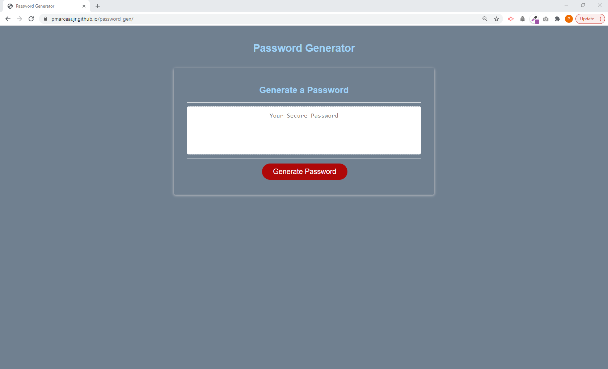

# password_gen

DESCRIPTION: A small JavaScript program to generate random passwords.

GOAL: BUild a web app that will gerneate a random passsword for the users. The web app will ask the user a series of questions and validate the respononses.

1.  ASk for length and validate the length of the password will be at least 8 characters long and no more than 128 charaters.
2.  Ask if UPPER case letters should be included.
3.  Ask if LOWER case letter sshould be included.
4.  Ask if NUMBERS should be included.
5.  Ask if SPECIAL characters should be included.

If the user does ont enter a value in the first prompt or clicks "esc", the web app will end. If the user enters a vaue below 8 of greater than 128, the user will be asked to enter a valid length. If the user does not select a valid character set to use to construct the password, the user will be prompted again to pick the characters sets to use. The password will be randonly generated to match the length specifed in the first promtp window and using all the characters that were approved with the other prompts. The password wwill be displayed in the browser.

LINK: https://pmarceaujr.github.io/password_gen/

SCREENSHOT: 
